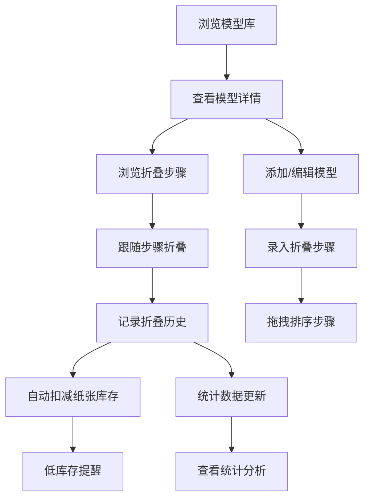

## 1. 产品概述

个人折纸模型记录与折叠步骤管理助手，是一款面向折纸爱好者的全栈Web应用，帮助用户系统化管理折纸模型库、折叠步骤与折叠历史，记录技艺进步轨迹。

- 目标用户：折纸爱好者、手工艺术学习者
- 核心价值：从模型收藏、步骤管理到历史记录的全流程折纸体验数字化

## 2. 核心功能

### 2.1 用户角色

| 角色 | 注册方式 | 核心权限 |
|------|----------|----------|
| 普通用户 | 本地使用，无需注册 | 模型管理、步骤管理、历史记录、库存管理、数据统计 |

### 2.2 功能模块

1. **模型库管理**：模型CRUD、分类与难度筛选、多图上传、推荐纸张信息
2. **折叠步骤管理**：多步骤录入、拖拽排序、逐步浏览、自动播放、步骤配图
3. **折叠历史记录**：每次折叠记录、评价与心得、时间线展示、技艺进步轨迹
4. **纸张库存管理**：多类型纸张、尺寸规格颜色数量、自动扣减、低库存提醒
5. **数据统计**：模型分类分布、折叠趋势、热门排行、难度分布、纸张使用排行

### 2.3 页面详情

| 页面名称 | 模块名称 | 功能描述 |
|----------|----------|----------|
| 仪表盘 | 统计概览 | 核心数据卡片、快速入口、最近折叠记录 |
| 模型库 | 模型列表 | 卡片式展示、分类筛选、难度筛选、搜索 |
| 模型详情 | 模型信息 + 步骤 + 历史 | 模型基本信息、折叠步骤时间轴、历史记录时间线 |
| 模型编辑 | 表单编辑 | 模型CRUD、多图上传、步骤编辑、拖拽排序 |
| 步骤浏览 | 步骤播放器 | 逐步浏览、上一步/下一步、自动播放、进度指示 |
| 折叠记录 | 历史列表 + 时间线 | 历次折叠记录、评价心得、成品照片、进步轨迹 |
| 纸张库存 | 库存列表 | 纸张类型、尺寸、颜色、数量、低库存提醒、出入库 |
| 统计中心 | 图表展示 | 分类分布饼图、月度趋势折线图、排行柱状图 |

## 3. 核心流程

用户从模型库浏览或搜索感兴趣的折纸模型，查看模型详情与折叠步骤，跟随步骤进行折叠。折叠完成后记录本次折叠的用纸、用时、评价与心得。系统自动扣减纸张库存，低库存时提醒补充。统计中心展示各类数据洞察，帮助用户了解自己的折纸习惯与进步。

## 4. 用户界面设计

### 4.1 设计风格

- **主色调**：温暖的暖橙色系 (#F97316)，搭配柔和的米白色背景，体现手工艺术的温度感
- **辅助色**：深绿色 (#059669) 用于成功/完成状态，玫红色 (#DB2777) 用于强调
- **按钮风格**：圆润圆角 (12px)，微阴影，悬停时轻微上浮
- **字体**：标题使用 'Noto Serif SC' 衬线字体体现优雅，正文使用 'Inter' 无衬线保证可读性
- **布局风格**：卡片式布局，大量留白，柔和阴影，温暖质感
- **图标风格**：Lucide 线性图标，统一描边宽度

### 4.2 页面设计概览

| 页面名称 | 模块名称 | UI 元素 |
|----------|----------|---------|
| 仪表盘 | 统计概览 | 渐变色数据卡片、图标、快速操作按钮、最近记录时间线 |
| 模型库 | 模型列表 | 筛选标签栏、搜索框、卡片网格、悬停动效 |
| 模型详情 | 信息 + 步骤 + 历史 | 图片轮播、信息标签页、步骤时间轴、历史时间线 |
| 步骤浏览 | 步骤播放器 | 大图展示、步骤序号、文字说明、进度条、播放控制 |
| 纸张库存 | 库存列表 | 颜色标签、数量徽章、低库存警告标识、出入库按钮 |
| 统计中心 | 图表展示 | 饼图、折线图、柱状图、数据表格、排行榜 |

### 4.3 响应式

- 桌面端优先设计，响应式适配平板与手机
- 卡片网格在不同断点下自动调整列数
- 移动端底部导航栏，桌面端侧边导航

### 4.4 动画与交互

- 页面切换：淡入淡出 + 轻微位移
- 卡片悬停：上浮 + 阴影加深
- 步骤切换：平滑过渡动画
- 自动播放：进度条动态填充
- 数据加载：骨架屏脉冲动画
