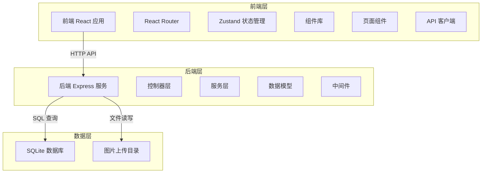
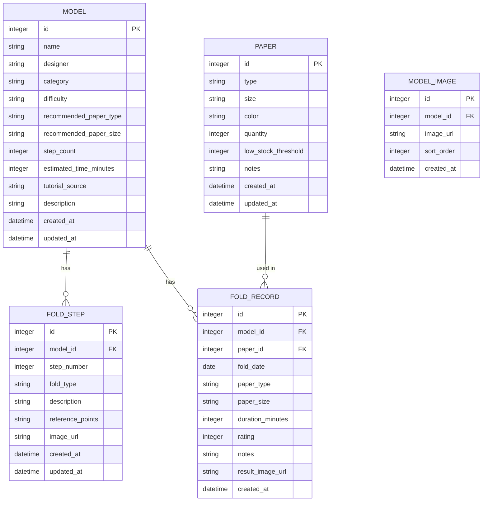
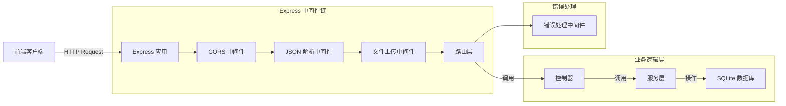

## 1. 架构设计



## 2. 技术描述

- **前端**：React@18 + TypeScript + Vite + TailwindCSS@3 + React Router DOM + Zustand
- **后端**：Express@4 + TypeScript + better-sqlite3
- **数据库**：SQLite（嵌入式，无需额外服务，适合个人使用）
- **文件存储**：本地文件系统（uploads 目录）
- **图标库**：lucide-react
- **图表库**：recharts
- **拖拽库**：@dnd-kit/core + @dnd-kit/sortable
- **HTTP客户端**：axios

## 3. 路由定义

### 前端路由

| 路由路径 | 页面名称 | 功能描述 |
|----------|----------|----------|
| / | 仪表盘 | 统计概览与快速入口 |
| /models | 模型库 | 模型列表、筛选与搜索 |
| /models/:id | 模型详情 | 模型信息、步骤、历史 |
| /models/new | 新建模型 | 模型创建表单 |
| /models/:id/edit | 编辑模型 | 模型编辑表单 |
| /models/:id/steps | 步骤浏览 | 折叠步骤播放器 |
| /folds | 折叠历史 | 所有折叠记录列表 |
| /paper | 纸张库存 | 纸张库存管理 |
| /statistics | 统计中心 | 数据统计图表 |

### 后端 API 路由

| 方法 | 路由路径 | 功能描述 |
|------|----------|----------|
| GET | /api/models | 获取模型列表（支持筛选） |
| GET | /api/models/:id | 获取模型详情 |
| POST | /api/models | 创建新模型 |
| PUT | /api/models/:id | 更新模型 |
| DELETE | /api/models/:id | 删除模型 |
| GET | /api/models/:id/steps | 获取模型步骤列表 |
| POST | /api/models/:id/steps | 新增折叠步骤 |
| PUT | /api/steps/:id | 更新折叠步骤 |
| DELETE | /api/steps/:id | 删除折叠步骤 |
| PUT | /api/models/:id/steps/reorder | 步骤重新排序 |
| GET | /api/folds | 获取折叠历史列表 |
| GET | /api/models/:id/folds | 获取模型的折叠历史 |
| POST | /api/folds | 新增折叠记录 |
| PUT | /api/folds/:id | 更新折叠记录 |
| DELETE | /api/folds/:id | 删除折叠记录 |
| GET | /api/paper | 获取纸张库存列表 |
| POST | /api/paper | 新增纸张库存 |
| PUT | /api/paper/:id | 更新纸张库存 |
| DELETE | /api/paper/:id | 删除纸张库存 |
| POST | /api/paper/:id/adjust | 调整纸张数量 |
| GET | /api/statistics/summary | 获取统计概览数据 |
| GET | /api/statistics/models-by-category | 按分类统计模型数 |
| GET | /api/statistics/folds-by-month | 按月统计折叠次数 |
| GET | /api/statistics/top-models | 最常折叠模型排行 |
| GET | /api/statistics/folds-by-difficulty | 按难度统计完成数 |
| GET | /api/statistics/top-paper | 纸张使用频次排行 |
| POST | /api/upload | 上传图片 |

## 4. 数据模型

### 4.1 数据模型定义



### 4.2 枚举值定义

- **分类 (category)**：动物、鸟类、昆虫、花朵、盒子、几何体、其他
- **难度 (difficulty)**：简单、中等、复杂、极复杂
- **折叠类型 (fold_type)**：谷折、山折、内翻折、外翻折、兔耳折、花瓣折、沉折、其他
- **纸张类型 (paper type)**：单面彩色、双面彩色、和纸、牛皮纸、锡纸、蜡纸、棉纸、其他
- **评价等级 (rating)**：1-5，1=失败，5=完美

## 5. 服务器架构



## 6. 项目结构

```
├── src/                          # 前端源码
│   ├── components/               # 可复用组件
│   │   ├── Layout/              # 布局组件
│   │   ├── ModelCard/           # 模型卡片
│   │   ├── StepPlayer/          # 步骤播放器
│   │   ├── Timeline/            # 时间线组件
│   │   └── ui/                  # 基础UI组件
│   ├── pages/                    # 页面组件
│   │   ├── Dashboard/           # 仪表盘
│   │   ├── ModelList/           # 模型列表
│   │   ├── ModelDetail/         # 模型详情
│   │   ├── ModelEditor/         # 模型编辑
│   │   ├── StepViewer/          # 步骤浏览
│   │   ├── FoldHistory/         # 折叠历史
│   │   ├── PaperInventory/      # 纸张库存
│   │   └── Statistics/          # 统计中心
│   ├── store/                    # Zustand 状态管理
│   ├── hooks/                    # 自定义 Hooks
│   ├── utils/                    # 工具函数
│   ├── types/                    # TypeScript 类型定义
│   ├── api/                      # API 客户端
│   ├── App.tsx
│   └── main.tsx
├── api/                          # 后端源码
│   ├── src/
│   │   ├── controllers/         # 控制器
│   │   ├── services/            # 服务层
│   │   ├── models/              # 数据模型
│   │   ├── routes/              # 路由定义
│   │   ├── middleware/          # 中间件
│   │   ├── db/                  # 数据库连接与初始化
│   │   ├── types/               # 类型定义
│   │   └── index.ts             # 入口文件
│   └── uploads/                 # 上传文件目录
├── shared/                       # 前后端共享类型
│   └── types.ts
├── migrations/                   # 数据库迁移
├── vite.config.ts
├── tailwind.config.js
├── tsconfig.json
└── package.json
```
